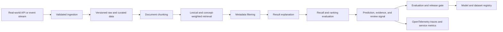

# Architecture

## Problem

Enterprise search needs explainable retrieval quality when embedding APIs are unavailable, expensive, or restricted.

## System Flow

## Components

- **Document chunking**
- **Lexical and concept-weighted retrieval**
- **Metadata filtering**
- **Result explanation**
- **Recall and ranking evaluation**

## Recommended Production Stack

- FastAPI for search and indexing APIs
- Sentence Transformers for dense embeddings
- PostgreSQL plus pgvector HNSW indexes
- BM25-compatible lexical retrieval
- Redis for query and embedding caches
- OpenTelemetry for latency and recall diagnostics

## Hugging Face Tasks

- `sentence-similarity`
- `feature-extraction`
- `text-ranking`
- `question-answering`

## Model Architecture

The included baseline is a transparent token-prototype model. Training builds
per-label token weights and inverse-document-frequency retrieval weights from
the synthetic training split. The runtime returns a prediction, confidence,
review flag, and evidence documents. This baseline is intentionally small so
it can run in CI without paid compute.

For production, compare it with domain embeddings, gradient-boosted models, or
fine-tuned transformer models using the same held-out evaluation contract.

## Production Boundaries

- Validate and version all input schemas.
- Keep human review for low-confidence or high-impact decisions.
- Store prompts, traces, model versions, and dataset versions together.
- Do not treat synthetic evaluation performance as production evidence.
- Add authentication, authorization, encryption, and retention controls.

## Known Risks

The lightweight lexical baseline is reproducible but should be replaced or compared with domain embeddings at scale.
